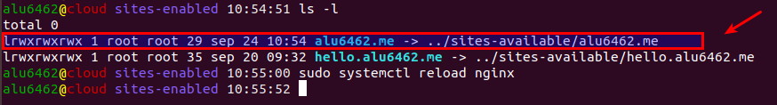

# Mis series favoritas

## 1.- Creacion de una location

La pagina debe poder abrirse usando http://alu6462.me/series/. Para ello vamos a usar nuestro servidor web y creamos una location para el dominio.

* Como se trata de una location dentro de un virtual host haremos lo siguiente:

```console

alu6462@cloud:~$ sudo vi /etc/nginx/sites-available/alu6462.me
```
* Una vez creado el fichero escribimos lo siguiente:

```console
server {
    server_name alu6462.me;

    location /series {
        root /home/alu6462/webapps;
    }
}
```
Una vez creado el fichero con la location le haremos un enlace simbolico a `../sites-available/alu6462.me`. Esto habilitara el fichero creado anteriormente.

```console

alu6462@cloud:/etc/nginx/sites-enabled$ ls -l
total 0
lrwxrwxrwx 1 root root 35 sep 16 15:35 vps.claseando.es -> ../sites-available/alu6462.me
lrwxrwxrwx 1 root root 41 sep 16 15:32 hello.alu6462.me -> ../sites-available/hello.alu6462.me
alu6462@cloud:/etc/nginx/sites-enabled$ sudo systemctl reload nginx
alu6462@cloud:/etc/nginx/sites-enabled$
```
* Hay que recargar la aplicacion nginx para que se guarden los cambios.

>Usar `reload` y no `restart` para que nuetsro servidor web pueda seguir aceptando solicitudes.



## 2.- Editar la pagina

Una vez creada la location `series` debemos añadir un index.html para modificar el contenido de la pagina.


>Por otro lado vamos a crear la carpeta `img` donde alojaremos las imagenes de nuestra pagina

* Dentro del `index.html` pondremos lo siguiente:

```html

<!DOCTYPE html>
<html>
<head>
    <title>Series preferidas</title>
    <meta charset="UTF-8">
    <meta name="description" content="">
    <meta name="keywords" content="">
</head>
<body>
        <h1>Series</h1>
            <a title="Serie 1" href="https://www.imdb.com/title/tt3107288/?ref_=nv_sr_1?ref_=nv_sr_1"></a>
            <a title="Serie 2" href="https://www.imdb.com/title/tt0436992/?ref_=nv_sr_1?ref_=nv_sr_1"></a>
            <a title="Serie 3" href="https://www.imdb.com/title/tt4052886/?ref_=nv_sr_2?ref_=nv_sr_2"></a>
            <a title="Serie 4" href="https://www.imdb.com/title/tt0182576/?ref_=nv_sr_1?ref_=nv_sr_1"></a>
            <a title="Serie 5" href="https://www.imdb.com/title/tt1355642/?ref_=nv_sr_1?ref_=nv_sr_1"></a>
</body>
</html>
```
* Las imagenes de las series como los enlaces y el listado fueron sacados de la pagina https://wwww.imdb.com.

## 3.- Resultado final.

Completado todo lo anterior nos debe de a ver quedado la pagina de la siguiente forma:


