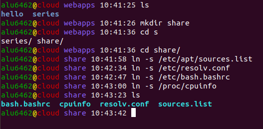
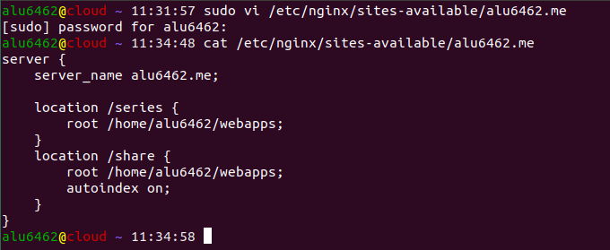
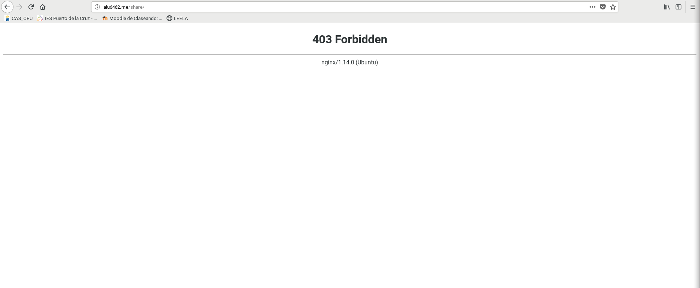
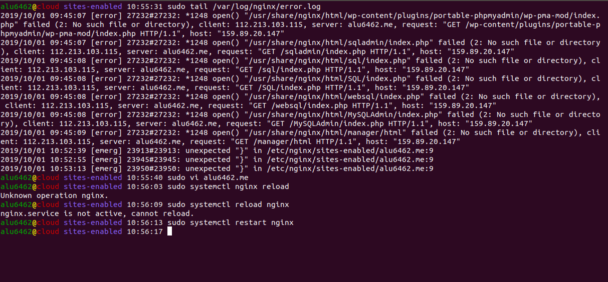

## UT1-A2: Listado de directorios
Para esta actividad vamos a enlazar un subdirectorio dentro de la ruta raíz de Nginx y enlazar con algunas series de ficheros

* En primer lugar vamos a crear una carpeta llamada ***share***, la cual estará alojada en webapps. Esta tendrá además enlaces simbólicos con los siguientes archivos:
 - `/etc/apt/sources.list` (repositorios de paquetes)
 - `/etc/resolv.conf` (listado de DNS)
 - `/etc/bash.bashrc` (configuración global de bash)
 - `/proc/cpuinfo` (características de la máquina)

>Se ejecutara con el comando ln -s

  

* A continuacióno vamos a crear un virtual host de la carpeta ***share*** a traves de nuestro dominio. Para ello vamos a `/etc/nginx/sites-available/alu6462.me` y añadimos un nuevo location(usamos el editor de texto `vi` con los permiso `sudo`)

>Es necesario poner `autoindex on;` debajo de root `/home/alu6462/webapps;` para que la pagina cree un index con los enlaces a los archivos. Sino dara un error 403 Fordibben

* Para acabar vamos a hacer un reload del servicio para cargar la nueva configuracion.

>En mi caso tuve que hacer un restart ya que cometi un error en la sintaxis del location y el servicio se cayo. Para ver el error use `sudo tail /var/log/nginx/error.log`.
