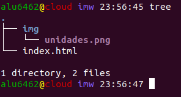
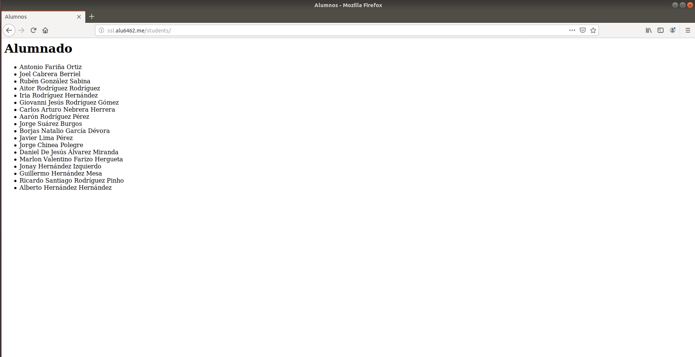
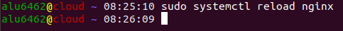

# UT1-A3: Trabajo con virtual hosts

### Sitio web 1

* En primer lugar vamos a crear el virtual host: http://imw.alu6462.me. Para ello creamos un fichero en la ruta **/etc/nginx/sites-available/imw.alu6462.me**. Hay que poner lo siguiente dentro:

* Luego enlazaremos dicho fichero a la ruta **/etc/nginx/sites-enabled** usando el comando ln -s

* Además de ello recargamos el servicio para que se cargue la configuracion de ngingx. Por otro lado creamos la carpeta imw dentro de webappps.

* A continuacion nos pasaremos con el comando scp una imagen de la máquina de desarrollo  a la máquina de producción.

* Despues de ello añadimos a nuestro fichero ***index.html*** la imagen que previamente nos hemos descargado.

> Comprobamos como ha quedado ahora la pagina

* Finalmente creamos un location editando el fichero **/etc/nginx/sites-available/imw.alu6462.me**. Además crearemos un index.html con el enlace al Real decreto del título de Administración de Sistemas Informáticos en Red - MEC.

### Sitio web 2

* Creamos un virtual host llamado varlib.alu6462.me el cual se escuche por el puerto 9000 y este la opción de ***autoindex on*** para listar los archivos.

* Por otro lado creamos un enlace a la ruta **/etc/nginx/sites-enabled** usando el comando ln -s. Y al final recargamos el servicio de nginx.

* Para finalizar creamos otro enlace con nuestra carpeta **/var/lib** usando **ln -s**. Y nos tendría que salir lo siguinte:

 ### Sitio web 3

* Para empezar vamos a crear un virtual host llamado ssl.alu6462.me y su location. Estará dentro de la carpeta **/etc/nginx/sites-available/ssl.alu6462.me**. Enlazaremos a la carpeta **/etc/nginx/sites-enabled** y recargaremos la configuración de nginx.

* Luego crearemos una carpeta llamada students y dentro haremos un archivo index.html con el nombre de los compañeros de clase.

* A continuacion vamos a obtener los certificados SSL y configurar el sitio web que queramos para que utilice protocolo https. Para ello usaremos la aplicaion cerbot haciendo los siguiente:

* Luego vamos abrir cerbot usando ***sudo certbot --nginx***. Y lo configuramos de la siguiente forma:

* Reiniciamos el servicio nginx:

* Se prohibira el acceso al fichero .htpasswd creando una constraseña y un usuario. El usuario sera admim. Se realizara de la siguiente forma:

>Añadimos tambien dos lineas al archivo donde creamos el virtual host

### Sitio web 4

* Primeramente nos descargamos un archivo de github usando wget(Previamente descargado).

* Luego lo descomprimes usando unzip y lo guardas dentro de webapps.

>Al paso anterior hay que crear una virtual host llamada http://target.alu6462.me
* Reiniciamos el servicio nginx:

* Creamos la carpeta /var/log/nginx/redirect para que no nos de fallo en lo siguiente que vamos a hacer:

* Finalmente creamos un virtual host que redireccione con el anterior creado, para ello debe de escuchar por el puerto 80 y tener salida por el 301. Además de tener que guardar los error en la ruta especifica que nosotros le marcamos.

* Reiniciamos el servivio y una vez comprobado que redirige a donde queremos miramos si ha ocurrido algún error durante el proceso.

 
