# Sitio web 1

#### 1.1 - Descomprimir archivo

* Primero vamos a descargar el archivo **demo_php.zip** del enunciado del ejercicio. Para ello usamos el siguiente comando: wget https://github.com/sdelquin/claseando/raw/master/imw/UT1/assignments/assignment4/demo_php.zip

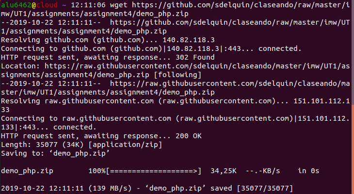

* Despues de ello usamos el comando **unzip demo_php.zip** para descomprimir el archivo.

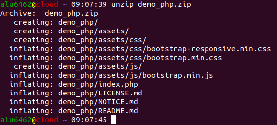

* Seguidamente cambiamos el archivo de lugar y lo movemos (Usando el comando mv) a webapps. Y para finalizar eliminaremos el archivo **demo_php.zip** (El cual esta ubicado en /home/alu6462) que nos descargamos anteriormente.

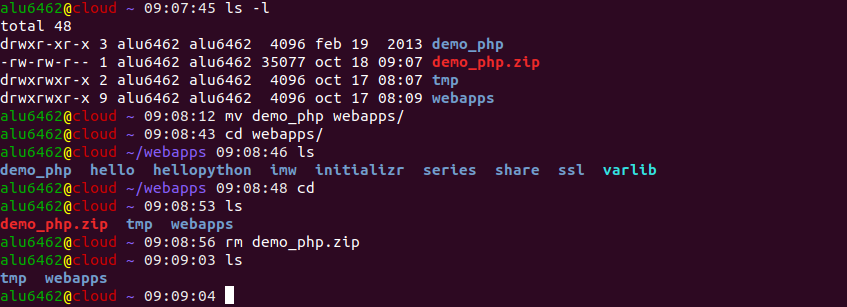

> El archivo **demo_php.zip** sigue ubicado en **/home/alu6462**, lo que movemos al directorio **/home/alu6462/webapps** es el directorio **demo_php**

#### 1.2 - Crear virtual host

* En primer lugar vamos a crear una virtual host llamda *php.alu6462.me*. Para ello creamos dentro del directorio **/etc/nginx/sites-available** el siguinte archivo:

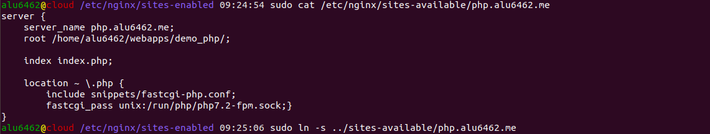

* Le tenemos que expesificar que coja el **index.php** y obligarlo a que lo utilice:

~~~console
---
index index.php
---
~~~

* Además hay que expecificar al servidor web que debe utilizar el módulo php-fpm cuando vaya a manejar ficheros .php y así interpretarlos.

~~~console
---
location ~ \.php {    
  include snippets/fastcgi-php.conf;    
  fastcgi_pass unix:/run/php/php7.2-fpm.sock;}
---
~~~

* Luego enlazaremos dicho fichero a la ruta **/etc/nginx/sites-enabled** usando el comando ln -s. Y por ultimo recargamos ngingx usando el comando **systemctl reload nginx**

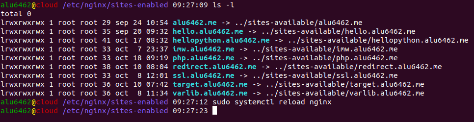

* Comprobamos el resultado final:

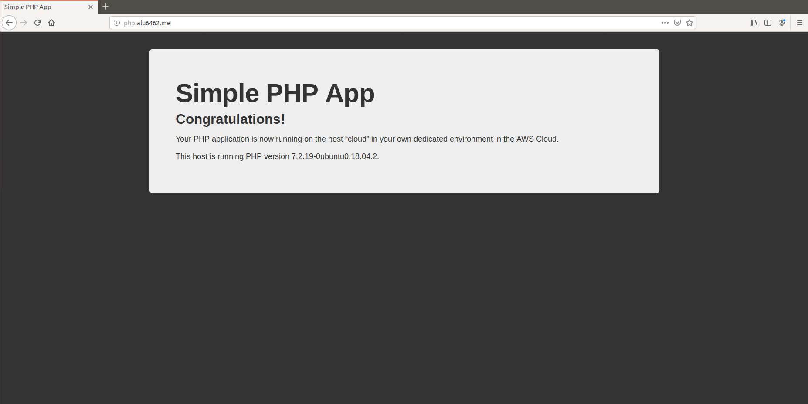

# Sitio web 2

#### 2.1 - Crear `main.py`

* Para empezar vamos a crear un archivo llamdo `main.py`, el cual es un codigo escrito en phyton. Para ello, y pensando en la creacion de la posterior virtual host, creamos tal archivo en **/home/alu6462/webapps/now**. El contenido del fichero será el siguiente:

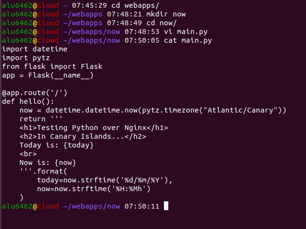

#### 2.2 - Instalar paquetes `flask` y `pytz`

* Instalamos los paquetes `flask` y `pytz` al entorno virtual. Para ello usamos el comando **pipenv install flask** y **pipenv install pytz**.

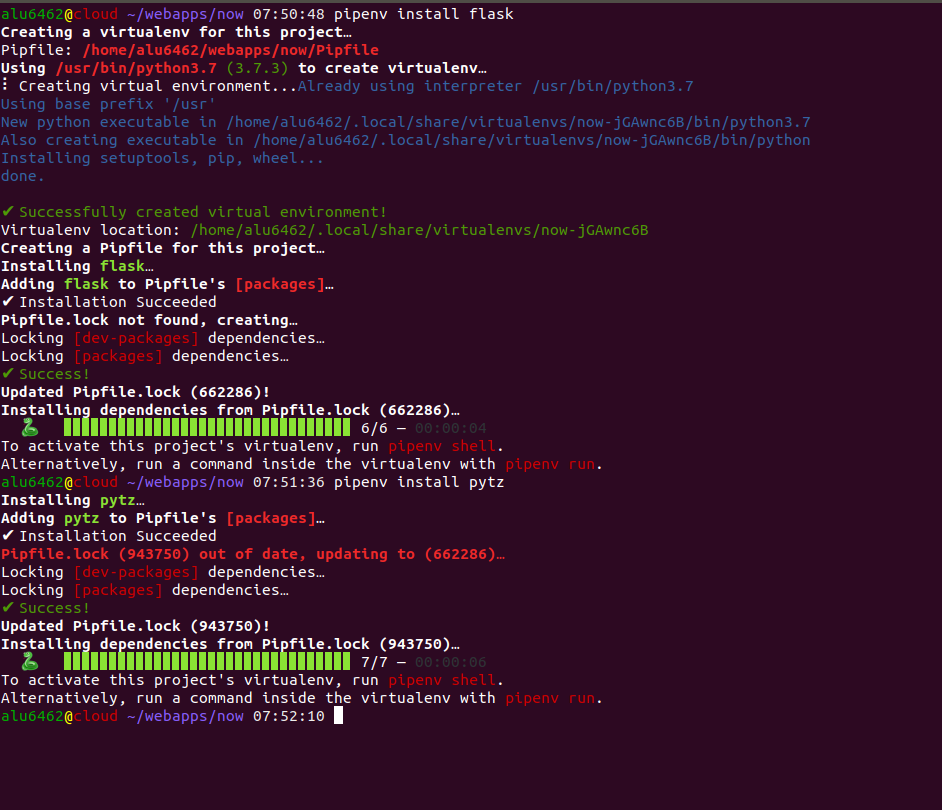

#### 2.3 - Crear Virtual host

* Para empezar vamos a crear un archivo en /etc/nginx/sites-available llamdo `now.alu6462.me`. Luego de ello enlazamos el fichero a la ruta **/etc/nginx/sites-enabled** usando el comando ln -s. Y por ultimo recargamos ngingx usando el comando **systemctl reload nginx**

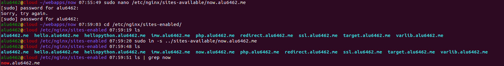

* Dentro del fichero hay una linea nueva que sirve para llamar a la funcion uwsgi y definir al puerto por el que seran escuchados (En nuestro caso 8081).

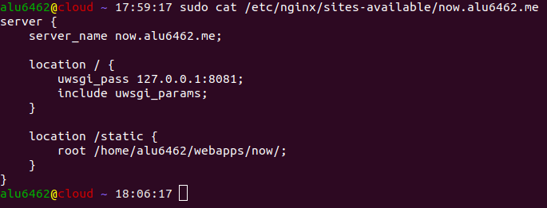

#### 2.4 Crear script

* A continuacion creamos un script para llamar al comando uwsgi cada vez que lo necesitemos. Además le damos permisos.

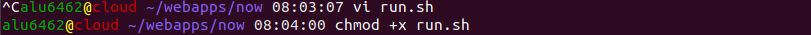

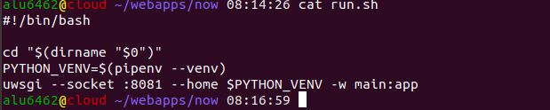

#### 2.5 Activar supervisor

* Ahora añadimos una nueva configuracion para supervisor, el cual activara el script que hemos creado anteriormente. Para ello vamos a crear el archivo en **/etc/supervisor/conf.d**.

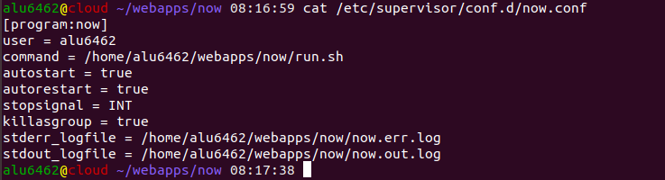

* Luego reiniciamos supervisor y miramos que el proseso esta corriendo.

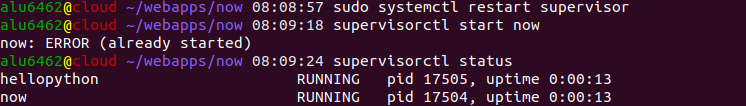

#### 2.6 Salida de comandos

* Probamos los siguientes comandos:

~~~console
$ supervisorctl status
~~~

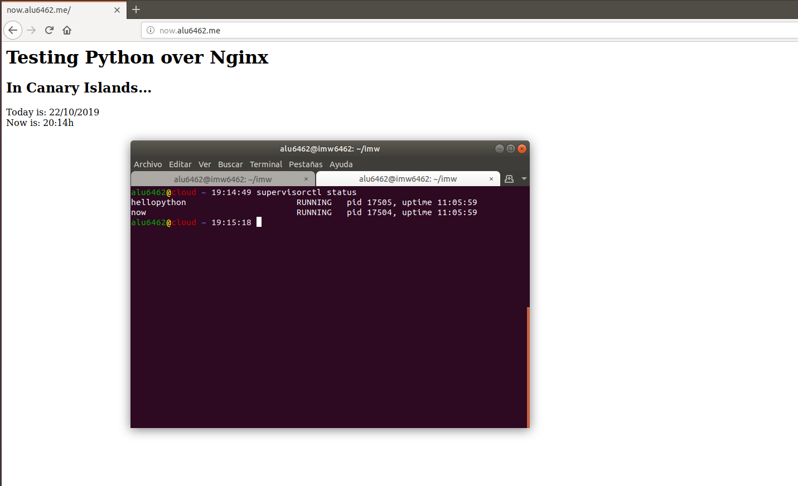

~~~console
$ supervisorctl start now
~~~

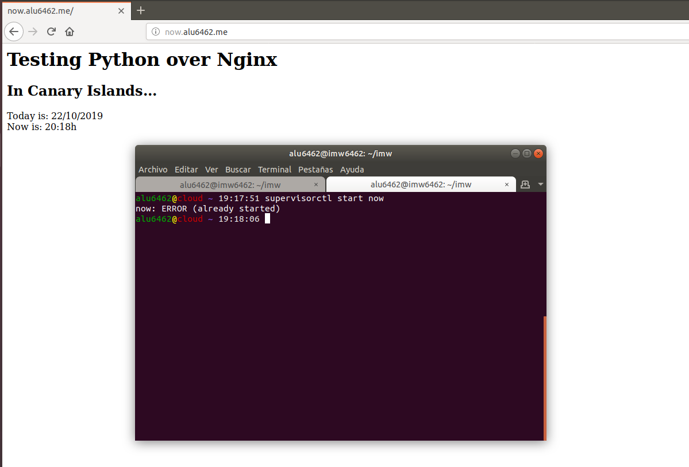

~~~console
$ supervisorctl stop now
~~~

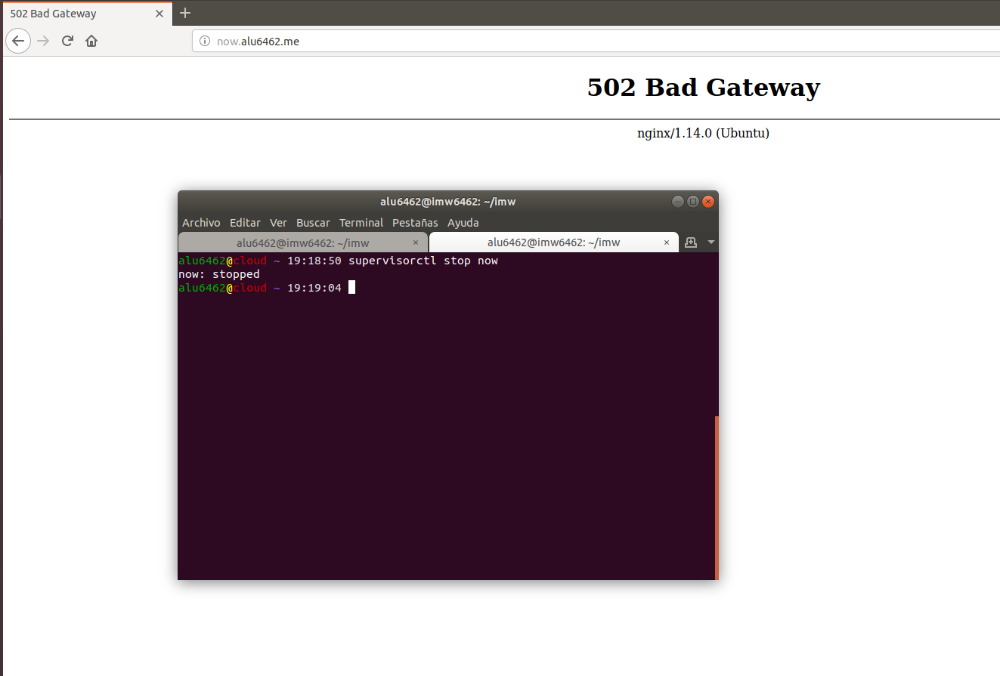

~~~console
$ supervisorctl restart now
~~~

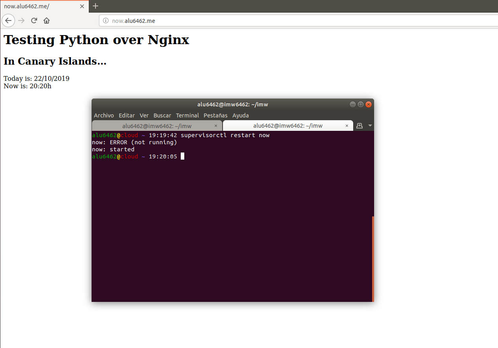
