# UT4-A1: Implantación de Wordpress.

### 1.- Instalación de Wordpress.

#### 1.1.- Base de datos

* En primer lugar vamos a crear una base de datos llamada wpdatabase. Además, por otro lado, crearemos un usuario llamado wpuser y le daremos todos los privilegios sobre la base de datos.

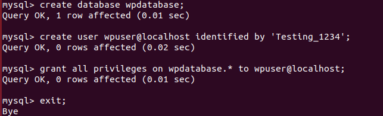

#### 1.2.- Descargar codigo

* Descargamos desde la pagina web de Wordpress el codigo fuente. Para ello primero vamos a */tmp* y ejecutamos el comando `curl` para conseguir el archivo **.zip**. Por ultimo descomprimimos el fichero descargado.

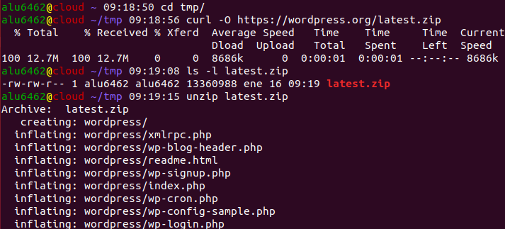

* Luego de ello copiamos con el comando `cp` el contenido del archivo descomprimido a **/usr/share/**. A continuacion usamos el comando `ls -ld` para ver que se ha descargado correctamente. Por ultimo le damos los permisos necesarios para que el usuario web www-data pueda usar estos ficheros, para ello usamos el comando `chown -R`.

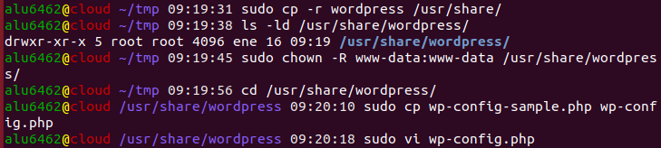

#### 1.3.- Fichero de configuración

* Editamos el archivo wp-config.php ubicado en **/usr/share/wordpress**. Dentro debemos especificar el nombre de la base de datos, el nombre del usuario y la contraseña.

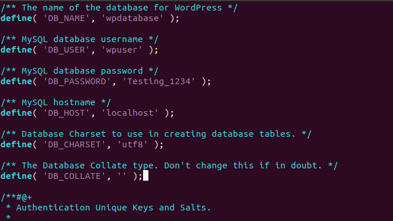

#### 1.4.- Nginx

* En primer lugar vamos a crear el virtual host: wordpress.alu6462.me. Para ello creamos un fichero en la ruta /etc/nginx/sites-available/wordpress.alu6462.me. Además hacemos un enlace a /etc/nginx/sites-enabled del fichero creado. Por ultimo reiniciamos Nginx.

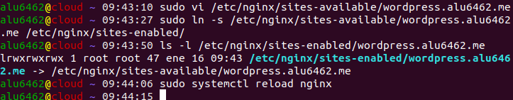

#### 1.5.- SSL

* A continuacion vamos a obtener los certificados SSL y configurar el sitio web que queramos para que utilice protocolo https. Para ello usamos el comando `cerbot --nginx` y marcamos las siguientes opciones:

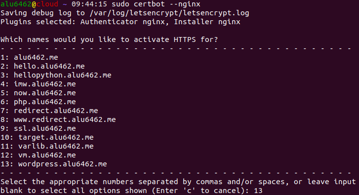

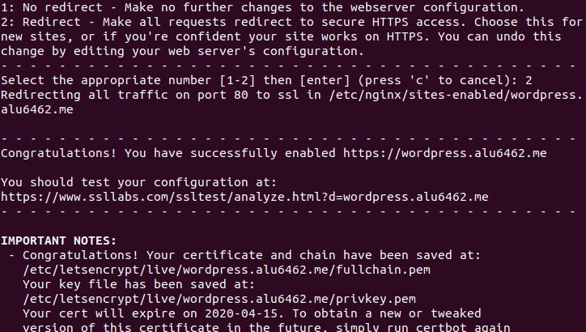

#### 1.6- Configuración vía web

* Accedemos a la dirección wordpress creada y configuramos el idioma.

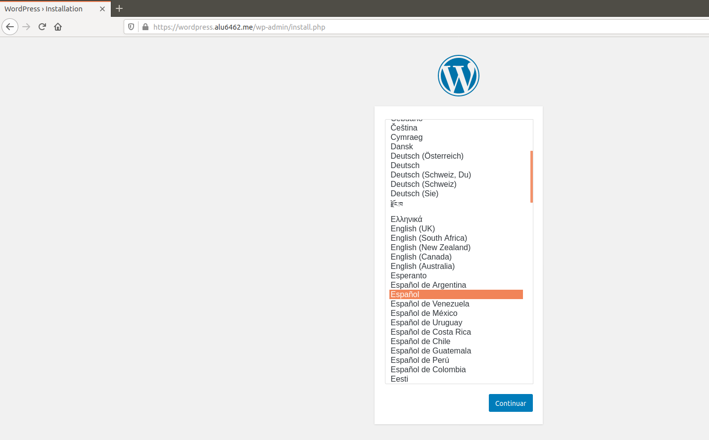

* Creamos usuario contraseña para acceder.

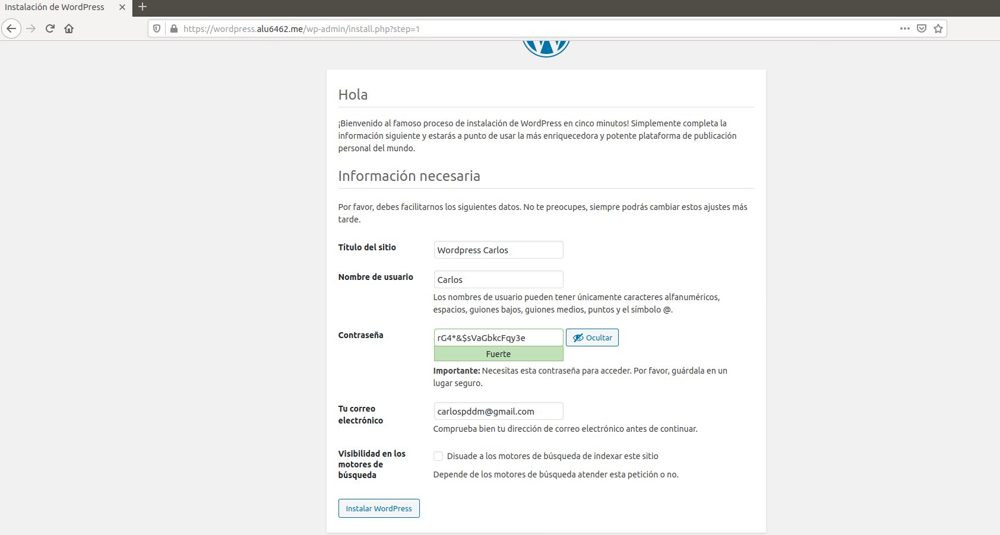

* Le damos a instalar wordpress.

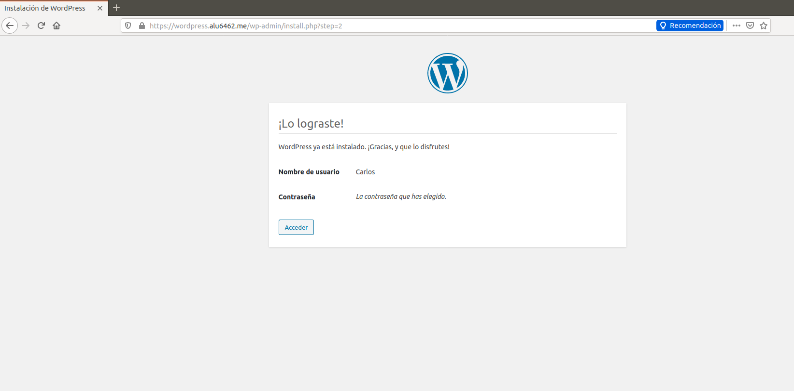

* Por ultimo accedemos a la interfaz administrativa.

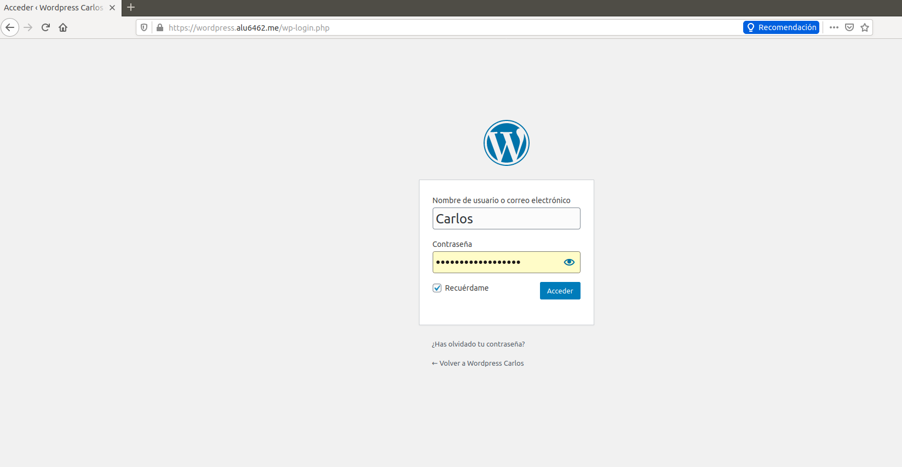

#### 1.7- Límite de tamaño

* Para ello editamos el fichero *php.ini* ubicado en **/etc/php/7.2/fpm/**. Y le ponemos los siguiente:

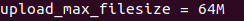

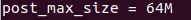

* Reiniciamos php-fpm.

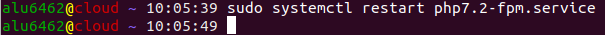

* Añadimos una linea en el archivo de configuracion de Nginx.

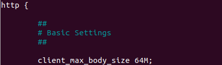

* Reiniciamos el servicio web

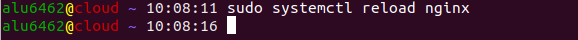

### 2.- Tema gratuito.

* Añadimos un tema gratuito yendo a Apariencia.

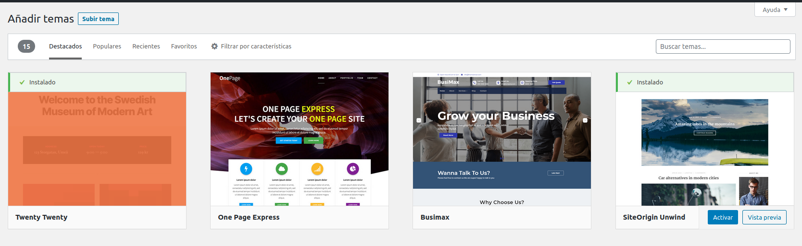

* Selecionamos un nuevo tema, lo instalamos y lo ponemos.

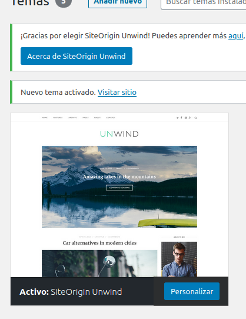

### 3.- Permalinks *Día y Nombre*.

* En primer lugar activamos la opción **Enlaces Permanentes** dentro de la interfaz administrativa.

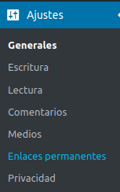

* Seleccionamos ajustes **Día y nombre**. Y pulsamos guardar cambios.

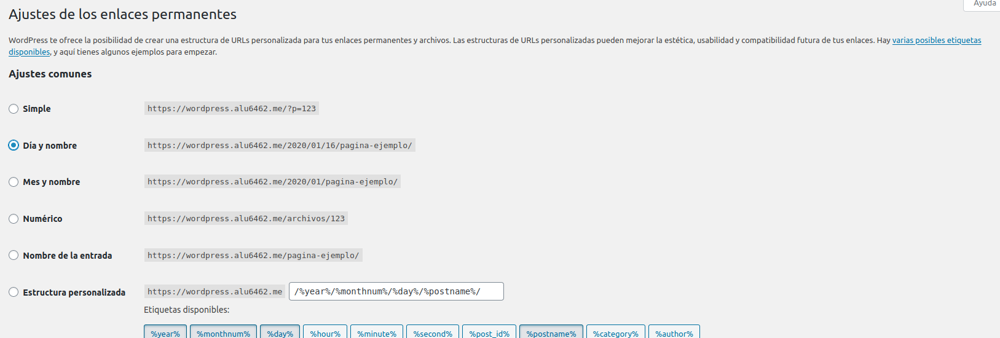

* Indicamos a Nginix  que procese las URLs añadiendo el siguiente location.

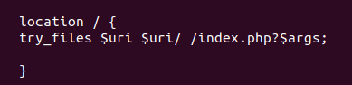

* Recargamos la configuracion de Nginx.

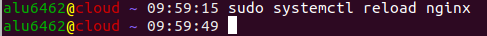

### 4.- Escribir un post.

* Vamos a Entradas -> Añadir nueva.

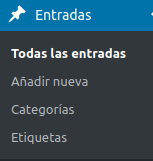

* Escribimos algo y lo guardamos. Por ultimo comprobamos.

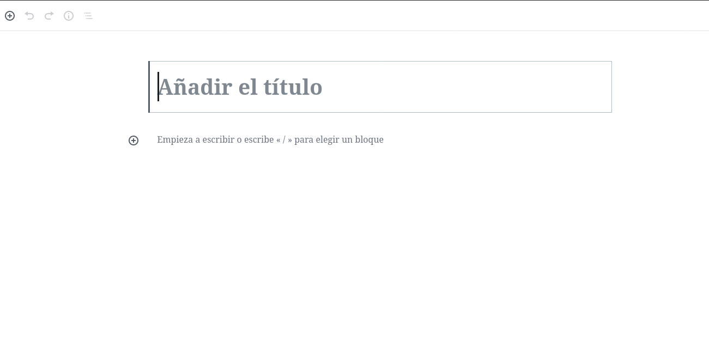

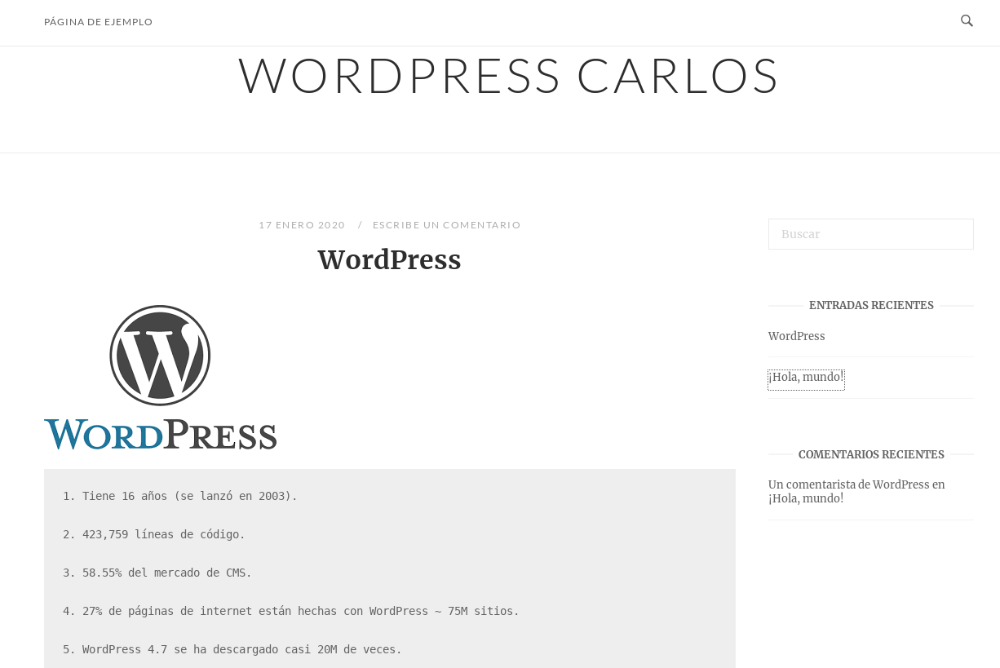
