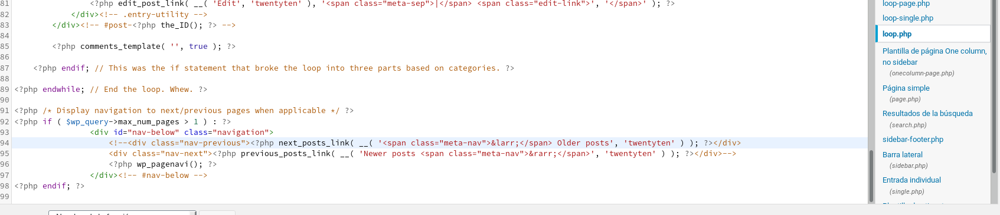

# Plugins de Wordpress

A continuación vamos a hacer un anlisis de los siguientes Plugins para Wordpress:

| Plugins                            |
|------------------------------------|
| BackWPup – WordPress Backup Plugin |
| WPS Hide Login                     |
| WP-PageNavi                        |

## BackWPup – WordPress Backup Plugin.

###### Descripción.

* Este plugin de *copias de seguridad*, **BackWPup**, sirve para
guardar la instalación completa incluyendo **/wp-content/** y
subirla a un servicio externo, como **Dropbox**, **S3**, **FTP** y
muchos más. Puedes restaurar facilmente una instalación con un
único archivo de *copia de seguridad*.

###### Tipo de páginas en las que sería útil.

* Las utilidades que se le pueden dar son necesarias para todo tipo de página ya que un *backup* de los ficheros más importantes siempre es necesario.

###### Widgets asociados.

* No tiene ningún *widgets* asociados.

###### Requerimientos/Dependencias.

* Para utilizar el *plugin* con toda su funcionalidad se necesita *PHP 5.3.3* con *mysqli*, *FTP*,*gz*, *bz2*, *ZipArchive* y *curl*.

###### Facilidad de instalación/activación.

* Es fácil y rápido de instalar siempre y cuando tengas los requerimientos que se especifican(4/5).

###### Facilidad de uso.

* Fácil de usar y programable para que haga las *copias de seguridad* por ti(4/5).

## WPS Hide Login.

###### Descripción.

* Este **plugin** permite cambiar de forma fácil y segura la *URL* de la página del formulario de inicio de sesión a lo que desees. El directorio **wp-admin** y la página **wp-login.php** se vuelven inaccesibles, por lo que debe marcar o recordar la *URL*.

###### Tipo de páginas en las que sería útil.

* Esta función sería útil en páginas que buscaran algo más de seguridad en los inicios de sesión de los usuarios.

###### Widgets asociados.

* No añade ni modifica ningún *widgets*.

###### Requerimientos/Dependencias.

* No funciona con complementos o temas que codifican **wp-login.php.**

###### Facilidad de instalación/activación.

* No hace falta instalar nada extra(5/5).

###### Facilidad de uso.

* Muy fácil de usar(5/5).

## WP-PageNavi.

###### Descripción.

* Este *plugin* genera enlaces de paginación amigables.

###### Tipo de páginas en las que sería útil.

* El *plugin* instalado sería útil en sitios web donde el contenido de páginas fuera muy elevado e hiciera falta una mejor visualización.

###### Widgets asociados.

* No tiene ningún *widgets* asociado.

###### Requerimientos/Dependencias.

* Requiere que se modifique una linea de configuración del archivo *footer.php* del tema actual que se este usando.

###### Facilidad de instalación/activación.

* Medianamente fácil de instalar(3/5).

###### Facilidad de uso.

* Fácil de usar(4/5).
